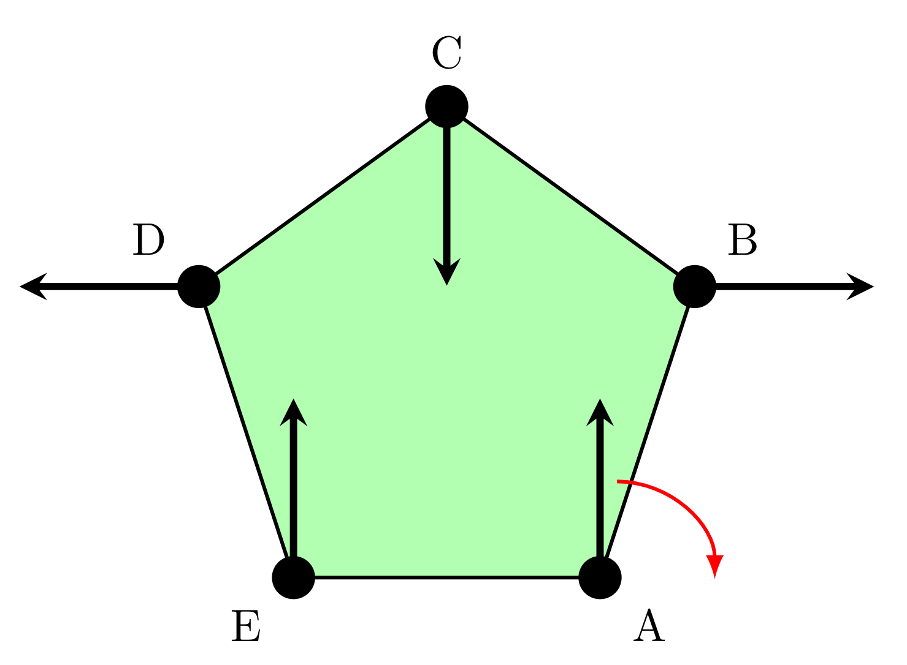
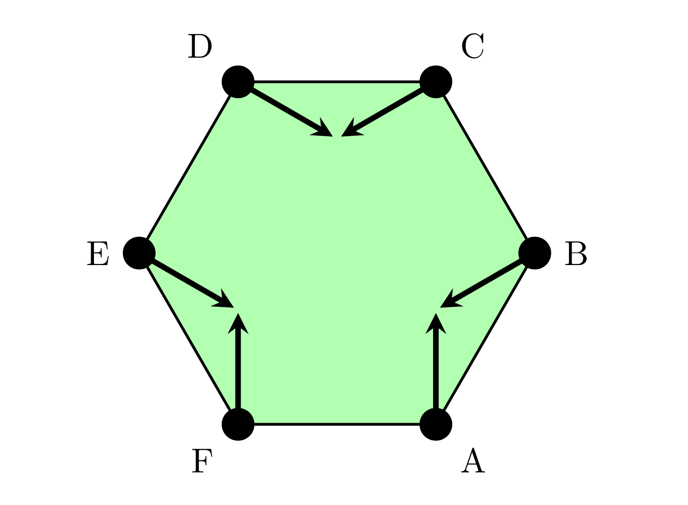

**Program time limit: 1 second**

**Program memory limit: 512 MB**

### Juggle
Terry the Chainsaw Juggler juggles chainsaws for a living at UNSW's Chainsaw Juggling Society, Chainsaw JuggleSoc. At each second a chainsaw wielded by Terry will arc across the sky, transitioning anticlockwise from one point on an $n$-sided polygon to another. Every second while in flight a chainsaw will also rotate $\frac{2 \pi}{d}$ radians around its base causing the tip of the chainsaw to enter the inside and outside of the central polygon. 

Terry lets $n$ chainsaws fly and is hoping to wow the crowd during his $k$ second performance. A flourish occurs when the tips of all $n$ chainsaws are pointing inside the central polygon. How many flourishes will Terry perform within his performance?

<figure>
  
  <figcaption>This is my caption text.</figcaption>
</figure>

<!-- 

     
    $n = 5, d = -4$. A single chainsaw begins its journey at $A$ and rotates $90^{\circ}$ clockwise every transition.

 -->

<!-- 

        <figcaption>$n = 5, d = -4$. A single chainsaw begins its journey at $A$ and rotates $90^{\circ}$ clockwise every transition.</figcaption>
    </figure>
    <figure>
        
    </figure>

 -->

### Input
The first line contains integers $n$, $k$ and $d$, the number of sides of the polygon, the number of seconds in the performance and the number of rotations a chainsaw will make in a revolution (every second a chainsaw rotates $\frac{2 \pi}{d}$ radians).

The second line contains $n$ integers $p_1, p_2 ... p_n$, the orientations of the $n$ chainsaws at 0 seconds. The $i^{th}$ chainsaw will make an angle $p_i \times \frac{2 \pi}{d}$ radians with the horizontal axis anticlockwise. 

The polygon's lowest side is always horizontal. The $i^{th}$ chainsaw begins at the $i^{th}$ vertex starting from the right most vertex of the lowest side going anticlockwise around the polygon.

You can assume chainsaws are shorter than the side length of the polygon. If a chainsaw intersects completely with an edge of the polygon it is considered inside the polygon. 

### Output
Output one integer, the number of flourishes that occur within the performance.

### Constraints

Not sure

